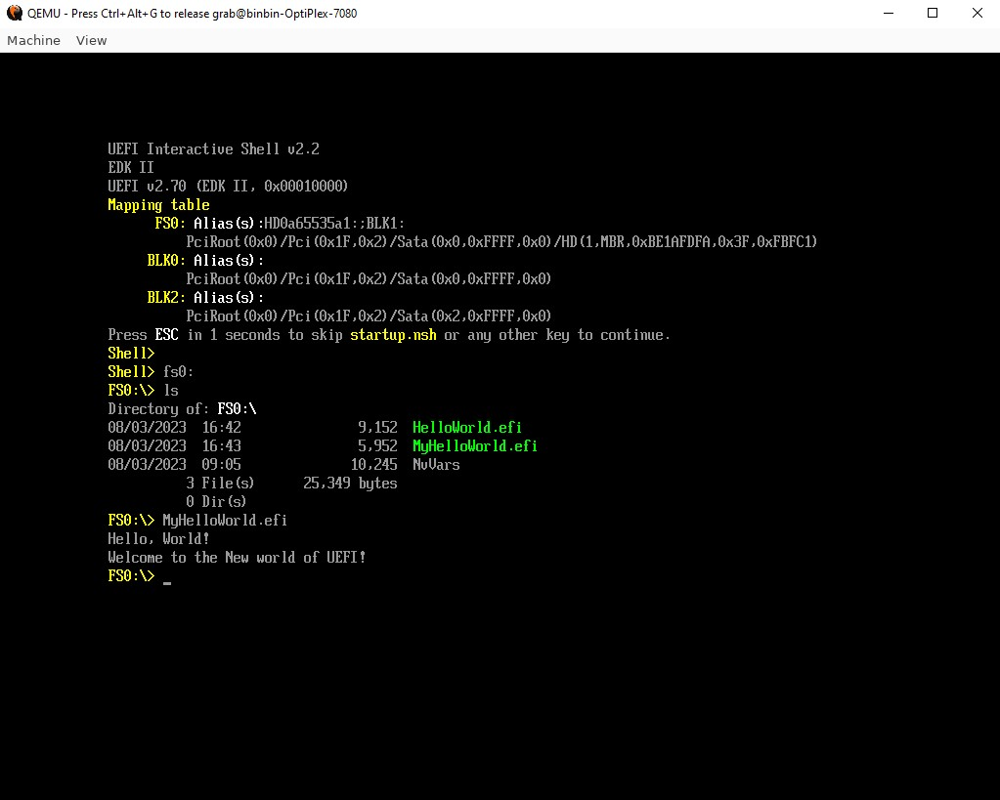

# UEFI-practice

## Environment for building
```bash
sudo apt install build-essential uuid-dev iasl
wget http://mirrors.kernel.org/ubuntu/pool/universe/n/nasm/nasm_2.15.05-1_amd64.deb
sudo dpkg -i nasm_2.15.05-1_amd64.deb
```
### Using docker container as a building environment
[ref](Dockerfile)
```bash
docker build -t "ubuntu_acpi" .
sudo docker run -v $PWD:/opt/workspace --name acpi_test --privileged -it ubuntu_acpi
```
## Build edk2
```bash
git clone https://github.com/tianocore/edk2
cd edk2; git submodule update --init

source edksetup.sh
make -C BaseTools

build -a IA32 -a X64 -t GCC5 -p OvmfPkg/OvmfPkgIa32X64.dsc -b DEBUG -D DEBUG_ON_SERIAL_PORT
```

## Demo Show(Hello World)

